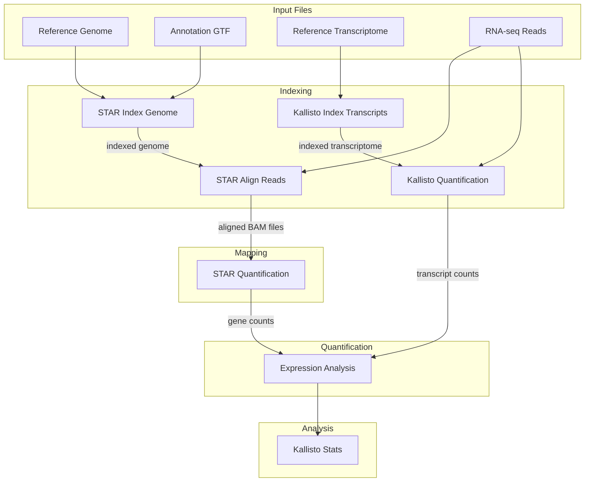

# Collaborative RNA-seq Analysis with Git and GitHub: A Bioinformatics Tutorial

## Workflow Overview



## Introduction

In this tutorial, we'll work together to create a collaborative RNA-seq analysis workflow for maize genetics. Each student will be responsible for implementing a specific component of the pipeline, and we'll use Git and GitHub to integrate our work into a complete analysis solution.

The pipeline consists of:
1. Indexing reference genome with STAR
2. Mapping reads with STAR 
3. Indexing transcriptome with Kallisto
4. Quantifying expression with Kallisto
5. Calculating stats with R

## Prerequisites

- Completed the "Setting Up Git and GitHub for R Users" tutorial
- RStudio installed and configured with Git
- Basic familiarity with R, bash scripting, and bioinformatics concepts
- GitHub account set up and authenticated from RStudio

## Setting Up the Collaborative Repository

### Step 1: Create a new R Project with Git

Let's start by creating a new R project that will serve as our repository:

1. Open RStudio
2. Click on "File" → "New Project" → "New Directory"
3. Select "New Project"
4. Enter "maizeRNA" as the directory name
5. Choose a parent directory where your project will be stored
6. Check "Create a git repository"
7. Click "Create Project"

### Step 2: Set up the folder structure

Now we'll create the necessary folder structure for our pipeline. In RStudio, open the Terminal tab and run:

```bash
# Create directories
mkdir -p scripts batch data ref results

# Create a README.md file
echo "# Maize RNA-seq Analysis Pipeline" > README.md
echo "" >> README.md
echo "A collaborative RNA-seq analysis workflow for maize genetics." >> README.md
```

### Step 3: Make your first commit

Let's commit the initial folder structure:

```bash
# Add all files to Git staging
git add .

# Commit the changes
git commit -m "Initial commit: Create project structure"
```

### Step 4: Create a GitHub repository and connect it

1. Go to GitHub.com
2. Click on the "+" icon in the top-right corner
3. Select "New repository"
4. Name it "maizeRNA"
5. Keep it as a public repository
6. Don't initialize with README, .gitignore, or license (we already have our structure)
7. Click "Create repository"

Now follow the instructions on GitHub to push an existing repository:

```bash
# Add the remote repository
git remote add origin https://github.com/YOUR_USERNAME/maizeRNA.git

# Push your changes to GitHub
git push -u origin main
```

## Implementing the RNA-seq Pipeline Components

Now that we have our repository set up, let's implement each component of the pipeline. Each student will be responsible for implementing one or more components.

### Component 1: STAR Genome Indexing

#### Step 1: Create the STAR index script

Create a file in the `scripts` directory named `STAR_index_genome_chr.sh`:

```bash
# In RStudio, navigate to the scripts folder and create a new file
cd scripts
touch STAR_index_genome_chr.sh
```

Open the new file in RStudio and add the following content:

```bash
#!/bin/bash

# Load required modules
#module load STAR/2.7.7a-foss-2020b

STAR=/usr/local/usrapps/maize/STAR-2.7.10b/bin/Linux_x86_64_static/STAR

# Set the path to the genome reference directory
# in this directory the index SAindex will be written
genomeDir=/rsstu/users/r/rrellan/sara/ref/NAM5_CHR

# Set the path to the annotation file
annotation=/rsstu/users/r/rrellan/sara/ref/Zea_mays.Zm-B73-REFERENCE-NAM-5.0.56.gtf

# Set the path to the output directory
# this only writes Log.out 
outputDir=aln_out

# Set the number of threads
threads=24

# Create the output directory
mkdir -p ${outputDir}

# Create the STAR index
${STAR} \
  --runThreadN ${threads} \
  --runMode genomeGenerate \
  --genomeDir ${genomeDir} \
  --genomeFastaFiles ${genomeDir}/*.fa \
  --sjdbGTFfile ${annotation} \
  --sjdbOverhang 100 \
  --outFileNamePrefix ${outputDir}/
```

#### Step 2: Create the batch submission script

Create a file in the `batch` directory named `q_STAR_index_genome_chr.sh`:

```bash
cd ../batch
touch q_STAR_index_genome_chr.sh
```

Open the new file and add:

```bash
#!/bin/bash
#BSUB -J star_index
#BSUB -q sara
#BSUB -n 24
#BSUB -R "span[hosts=1]"
#BSUB -R "rusage[mem=128GB]"
#BSUB -W 24:00
#BSUB -o %J.out
#BSUB -e %J.err

# Execute the STAR indexing script
../scripts/STAR_index_genome_chr.sh
```

#### Step 3: Commit these changes

```bash
# Make the scripts executable
chmod +x scripts/STAR_index_genome_chr.sh batch/q_STAR_index_genome_chr.sh

# Add and commit the new files
git add scripts/STAR_index_genome_chr.sh batch/q_STAR_index_genome_chr.sh
git commit -m "Add STAR genome indexing scripts"
git push origin main
```

### Component 2: STAR Read Alignment

#### Step 1: Create the alignment script

Create a file in the `scripts` directory named `align_sample.sh`:

```bash
cd ../scripts
touch align_sample.sh
```

Add the following content:

```bash
#!/bin/bash

# Load required modules
# module load STAR/2.7.7a-foss-2020b

STAR=/usr/local/usrapps/maize/STAR-2.7.10b/bin/Linux_x86_64_static/STAR

# Set the path to the genome reference directory
genomeDir=/rsstu/users/r/rrellan/sara/ref/NAM5_CHR

# Set the path to the annotation file
annotation=/rsstu/users/r/rrellan/sara/ref/Zea_mays.Zm-B73-REFERENCE-NAM-5.0.56.gtf

# Set the path to the fastq files directory
fastqDir=/rsstu/users/r/rrellan/sara/RNAseq/RellanAlvarez

# Set the path to the output directory
# this only writes Log.out 
outputDir=aln_out

# Set the suffix for read 1 and read 2
read1Suffix="_R1_001.fastq.gz"
read2Suffix="_R2_001.fastq.gz"

# Get the sample name as a command line argument
sample=$1

# Set the paths to the fastq files for the current sample
read1=${fastqDir}/${sample}${read1Suffix}
read2=${fastqDir}/${sample}${read2Suffix}

# Set the output file name for the current sample
outputFile=${outputDir}/${sample}

# Create the output directory
mkdir -p ${outputDir}

# Run STAR alignment on the current sample's fastq files and indexed genome
${STAR} \
     --runThreadN 8 \
     --genomeDir ${genomeDir} \
     --sjdbGTFfile ${annotation} \
     --readFilesCommand zcat \
     --readFilesIn ${read1} ${read2} \
     --outSAMtype BAM SortedByCoordinate \
     --outFileNamePrefix ${outputFile} \
     --outReadsUnmapped Fastx
```

#### Step 2: Create the batch submission script

Create a file in the `batch` directory named `q_STAR_align.sh`:

```bash
cd ../batch
touch q_STAR_align.sh
```

Add the following content:

```bash
#!/bin/bash

# Set the path to the sample list file
sampleList=$1

# Loop over the sample names in the sample list file
while read sample; do
  # Construct the bsub command to run the alignment job for the current sample
  # par="-q sara -n 12 -R 'span[hosts=1]' -R 'rusage[mem=32GB]' -W 4:00 -o %J.stdout -e %J.stderr" 
  par="-q sara -n 8 -W 4:00 -o %J.stdout -e %J.stderr" 
  echo $sample 
  echo $par
  # Submit the bsub command to the job scheduler
  bsub -R 'span[hosts=1]' -R 'rusage[mem=24GB]' $par ../scripts/align_sample.sh ${sample}
done < ${sampleList}
```

#### Step 3: Commit these changes

```bash
# Make the scripts executable
chmod +x scripts/align_sample.sh batch/q_STAR_align.sh

# Add and commit the new files
git add scripts/align_sample.sh batch/q_STAR_align.sh
git commit -m "Add STAR read alignment scripts"
git push origin main
```

### Component 3: STAR Quantification

#### Step 1: Create the quantification script

Create a file in the `scripts` directory named `STAR_quant_sample.sh`:

```bash
cd ../scripts
touch STAR_quant_sample.sh
```

Add the following content:

```bash
#!/bin/bash

# Load required modules
# module load STAR/2.7.7a-foss-2020b

STAR=/usr/local/usrapps/maize/STAR-2.7.10b/bin/Linux_x86_64_static/STAR

# Set the path to the genome reference directory
genomeDir=/rsstu/users/r/rrellan/sara/ref/NAM5_CHR

# Set the path to the annotation file
annotation=/rsstu/users/r/rrellan/sara/ref/Zea_mays.Zm-B73-REFERENCE-NAM-5.0.56.gtf

# Set the path to the fastq files directory
fastqDir=/rsstu/users/r/rrellan/sara/RNAseq/RellanAlvarez

# Set the path to the output directory
outputdir=counts_out
bamdir=aln_out

# Get the sample name as a command line argument
sample=$1

bamfile=$bamdir/${sample}Aligned.sortedByCoord.out.bam

# Create the output directory
mkdir -p ${outputdir}

# Run STARcount on the current sample's bam files
${STAR} \
     --quantMode GeneCounts \
     --runMode inputAlignmentsFromBAM \
     --inputBAMfile ${bamfile} \
     --runThreadN 8
```

#### Step 2: Commit these changes

```bash
# Make the script executable
chmod +x scripts/STAR_quant_sample.sh

# Add and commit the new file
git add scripts/STAR_quant_sample.sh
git commit -m "Add STAR quantification script"
git push origin main
```

### Component 4: Kallisto Index

#### Step 1: Create the Kallisto index script

Create a file in the `batch` directory named `q_kallisto_idx.sh`:

```bash
cd ../batch
touch q_kallisto_idx.sh
```

Add the following content:

```bash
#!/bin/bash
#BSUB -J kallisto_index
#BSUB -n 1
#BSUB -R "rusage[mem=2GB]"
#BSUB -W 00:20:00
#BSUB -o %J.stdout
#BSUB -e %J.stderr

# Activate conda environment
conda activate /usr/local/usrapps/maize/sorghum/conda/envs/rnaseq

index=Zm-B73-REFERENCE-NAM-5.0.cdna.all.idx
transcripts=/rsstu/users/r/rrellan/sara/ref/Zea_mays.Zm-B73-REFERENCE-NAM-5.0.cdna.all.fa

kallisto index -i ${index} ${transcripts}
```

#### Step 2: Commit these changes

```bash
# Make the script executable
chmod +x batch/q_kallisto_idx.sh

# Add and commit the new file
git add batch/q_kallisto_idx.sh
git commit -m "Add Kallisto index script"
git push origin main
```

### Component 5: Kallisto Quantification

#### Step 1: Create the quantification script

Create a file in the `scripts` directory named `kal_quant_sample.sh`:

```bash
cd ../scripts
touch kal_quant_sample.sh
```

Add the following content:

```bash
#!/bin/bash

# Load required modules
conda activate /usr/local/usrapps/maize/sorghum/conda/envs/rnaseq

# Set the path to the kallisto index
index=Zm-B73-REFERENCE-NAM-5.0.cdna.all.idx
# Set the path to the transcripts fasta file
transcripts=/rsstu/users/r/rrellan/sara/ref/Zea_mays.Zm-B73-REFERENCE-NAM-5.0.cdna.all.fa

# Set the suffix for read 1 and read 2
read1Suffix="_R1_001.fastq.gz"
read2Suffix="_R2_001.fastq.gz"

# Set the path to the fastq files directory
fastqDir=/rsstu/users/r/rrellan/sara/RNAseq/RellanAlvarez

# Get the sample name as a command line argument
sample=$1

# Set the path to the output directory
outputDir=quant_out/${sample}

# Set the paths to the fastq files for the current sample
read1=${fastqDir}/${sample}${read1Suffix}
read2=${fastqDir}/${sample}${read2Suffix}

# Create the output directory
mkdir -p ${outputDir}

# Run kallisto quantification
kallisto quant -i ${index} -o ${outputDir} ${read1} ${read2}
```

#### Step 2: Create the batch submission script

Create a file in the `batch` directory named `q_kal_quant_sample.sh`:

```bash
cd ../batch
touch q_kal_quant_sample.sh
```

Add the following content:

```bash
#!/bin/bash

# Set the path to the sample list file
sampleList=$1
index=Zm-B73-REFERENCE-NAM-5.0.cdna.all.idx
transcripts=/rsstu/users/r/rrellan/sara/ref/Zea_mays.Zm-B73-REFERENCE-NAM-5.0.cdna.all.fa

# Loop over the sample names in the sample list file
while read sample; do
  # Construct the bsub command to run the alignment job for the current sample
  # par="-q sara -n 12 -R 'span[hosts=1]' -R 'rusage[mem=32GB]' -W 4:00 -o %J.stdout -e %J.stderr" 
  par="-n 1 -W 4:00 -o %J.stdout -e %J.stderr" 
  echo $sample 
  echo $par
  # Submit the bsub command to the job scheduler
  bsub -R 'rusage[mem=2GB]' ${par} ../scripts/kal_quant_sample.sh ${sample}
done < ${sampleList}
```

#### Step 3: Commit these changes

```bash
# Make the scripts executable
chmod +x scripts/kal_quant_sample.sh batch/q_kal_quant_sample.sh

# Add and commit the new files
git add scripts/kal_quant_sample.sh batch/q_kal_quant_sample.sh
git commit -m "Add Kallisto quantification scripts"
git push origin main
```

### Component 6: Expression Analysis with R

#### Step 1: Create the R analysis script

Create a file in the `scripts` directory named `kallisto_stats.R`:

```bash
cd ../scripts
touch kallisto_stats.R
```

Add the following content:

```R
# Kallisto RNA-seq Statistics and Analysis
# This script processes Kallisto quantification results

# Load required libraries
library(dplyr)
library(tidyr)
library(ggplot2)
library(lubridate)

# Read sample metadata 
sample_info <- read.csv("../data/sample_info.csv", header = TRUE)
plots <- read.csv("../data/plots_info.csv")

# Join metadata
metadata <- sample_info %>%
  dplyr::inner_join(plots, by= c(row ="PHO22")) 

# Process time information
metadata <- within(metadata, {
  TIME = sub("1:","13:",metadata$TIME)
  TIME = hm(TIME)
  decimal_time <- hour(TIME) + minute(TIME)/60 + second(TIME) / 3600
})

# Save processed metadata
write.csv(
  metadata, 
  file="../data/inv4mRNAseq_metadata.csv", 
  row.names = FALSE
)

# Read kallisto QC data
kalqc <- read.table("../results/kallisto_qc.tab", sep = "\t", 
                   header = FALSE, skip = 1)
colnames(kalqc) <- c("gsl_sample","pseudoaligned_pct",
                    "pseudoaligned", "processed")
kalqc$tube <- substr(kalqc$gsl_sample, 1, 3)

# Plot QC statistics
kalqc %>%
  tidyr::pivot_longer(pseudoaligned_pct:processed, 
                     names_to = "var", values_to = "value") %>%
  ggplot2::ggplot(aes(x=value)) +
  ggtitle("Kallisto pseudoalignment") +
  ylab("# tissue libraries") +
  xlab("read stat") +
  geom_histogram() +
  facet_wrap(~ var, scales = "free") +
  theme_classic()

# Save the plot
ggsave("../results/kallisto_alignment_stats.png", width = 8, height = 6)

# Get sample directories
samples <- dir("../results/quant_out")

# Process gene expression data
all_exp <- lapply(samples, function(x) {
  print(x)
  sample_exp <- read.table(
    file.path("../results/quant_out", x, "abundance.tsv"), 
    sep = "\t", header = TRUE
  )
  sample_exp$est_counts <- as.integer(sample_exp$est_counts)
  sample_exp$gene = factor(sub("_T.+$", "", sample_exp$target_id, perl = TRUE))

  out <- sample_exp %>%
    dplyr::group_by(gene) %>%
    dplyr::summarize(counts = sum(est_counts))
  out$sample <- x
  out
}) %>% dplyr::bind_rows()

# Create gene-sample expression matrix
gene_sample_exp <- all_exp %>% 
  pivot_wider(names_from = "sample", values_from = "counts")

# Save expression matrix
write.csv(gene_sample_exp, "../results/gene_sample_exp.csv")
```

#### Step 2: Commit these changes

```bash
# Add and commit the new file
git add scripts/kallisto_stats.R
git commit -m "Add R script for kallisto expression analysis"
git push origin main
```

## Integrating the Pipeline

Now that all team members have contributed their components, let's create a workflow script that ties everything together.

### Step 1: Create a master workflow script

Create a file in the main directory named `run_pipeline.sh`:

```bash
cd ..
touch run_pipeline.sh
```

Add the following content:

```bash
#!/bin/bash

# Maize RNA-seq Analysis Pipeline
# This script orchestrates the full analysis workflow

echo "Starting RNA-seq analysis pipeline..."

# 1. Index the genome with STAR
echo "Step 1: Indexing genome with STAR..."
bsub < batch/q_STAR_index_genome_chr.sh

# Wait for the indexing job to complete
# In a real environment, you would check job status or use job dependencies
sleep 2

# 2. Index the transcriptome with Kallisto
echo "Step 2: Indexing transcriptome with Kallisto..."
bsub < batch/q_kallisto_idx.sh

# 3. Submit alignment jobs for all samples
echo "Step 3: Aligning reads with STAR..."
bsub < batch/q_STAR_align.sh sample_list.txt

# 4. Quantify expression with Kallisto
echo "Step 4: Quantifying expression with Kallisto..."
bsub < batch/q_kal_quant_sample.sh sample_list.txt

# 5. Run statistical analysis
echo "Step 5: Performing expression analysis..."
# This would typically be run once all previous jobs have completed
Rscript scripts/kallisto_stats.R

echo "Pipeline submitted. Check job status with bjobs."
```

### Step 2: Make it executable and commit

```bash
# Make the script executable
chmod +x run_pipeline.sh

# Add and commit the new file
git add run_pipeline.sh
git commit -m "Add master pipeline script"
git push origin main
```

### Step 3: Update the README.md

Edit the README.md file to include detailed instructions:

```markdown
# Maize RNA-seq Analysis Pipeline

A collaborative RNA-seq analysis workflow for maize genetics.

## Workflow Overview


## Directory Structure

- `batch/`: LSF job submission scripts
- `scripts/`: Individual analysis scripts
- `data/`: Input data files and metadata
- `ref/`: Reference genome and annotation files
- `results/`: Output files from the analysis

## Prerequisites

- LSF job scheduler
- STAR aligner
- Kallisto
- R with required packages: dplyr, tidyr, ggplot2, lubridate

## Usage

1. Clone this repository:
   ```
   git clone https://github.com/YOUR_USERNAME/maizeRNA.git
   cd maizeRNA
   ```

2. Create a sample list file:
   ```
   echo "sample1" > sample_list.txt
   echo "sample2" >> sample_list.txt
   ```

3. Run the full pipeline:
   ```
   ./run_pipeline.sh
   ```

## Individual Components

Each component can be run separately:

### 1. STAR Genome Indexing
```
bsub < batch/q_STAR_index_genome_chr.sh
```

### 2. Kallisto Transcriptome Indexing
```
bsub < batch/q_kallisto_idx.sh
```

### 3. STAR Read Alignment
```
bsub < batch/q_STAR_align.sh sample_list.txt
```

### 4. Kallisto Quantification
```
bsub < batch/q_kal_quant_sample.sh sample_list.txt
```

### 5. Expression Analysis
```
Rscript scripts/kallisto_stats.R
```

## Contributors

- Student 1: STAR Genome Indexing
- Student 2: STAR Read Alignment
- Student 3: Kallisto Indexing
- Student 4: Kallisto Quantification
- Student 5: Expression Analysis
```

### Step 4: Commit the updated README

```bash
# Add and commit the updated README
git add README.md
git commit -m "Update README with workflow documentation"
git push origin main
```

## Collaborative Workflow for Students

### Student Tasks

For each student participating in the collaborative project:

1. **Fork the Repository**:
   - Go to the instructor's GitHub repository
   - Click the "Fork" button in the top right
   - This creates a copy of the repository in the student's account

2. **Clone the Forked Repository**:
   ```bash
   git clone https://github.com/STUDENT_USERNAME/maizeRNA.git
   cd maizeRNA
   ```

3. **Create a Branch for Their Component**:
   ```bash
   git checkout -b add-component-X
   ```
   Where X is the component they're responsible for (e.g., "star-index", "kallisto-quant", etc.)

4. **Implement Their Component**:
   - Add or modify the necessary scripts
   - Test locally if possible

5. **Commit and Push Changes**:
   ```bash
   git add .
   git commit -m "Add component X"
   git push origin add-component-X
   ```

6. **Create a Pull Request**:
   - Go to the original repository
   - Click "New Pull Request"
   - Select "compare across forks"
   - Select the student's fork and branch
   - Submit the pull request with a description of changes

### Instructor Tasks

As the instructor, you'll need to:

1. **Review Pull Requests**:
   - Examine the code changes
   - Provide feedback
   - Request changes if necessary
   - Merge completed components

2. **Coordinate Integration**:
   - Ensure all components work together
   - Help resolve conflicts between pull requests
   - Test the full pipeline

3. **Final Integration**:
   - Once all components are merged, test the full pipeline
   - Make any necessary adjustments to ensure proper workflow

## Conclusion

This collaborative RNA-seq analysis pipeline project provides students with hands-on experience in:

1. Using Git and GitHub for collaborative bioinformatics projects
2. Implementing key components of an RNA-seq analysis workflow
3. Working with high-performance computing job schedulers
4. Processing and analyzing RNA-seq data for maize genetics

By dividing the workflow into manageable components and using Git for version control, students gain valuable experience in collaborative bioinformatics analysis while building a complete RNA-seq analysis pipeline.
